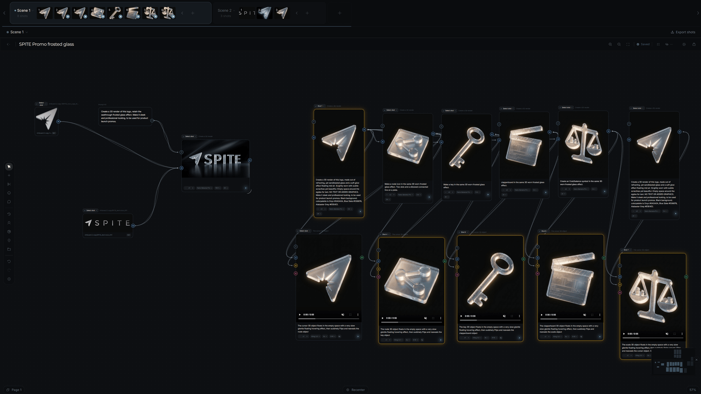
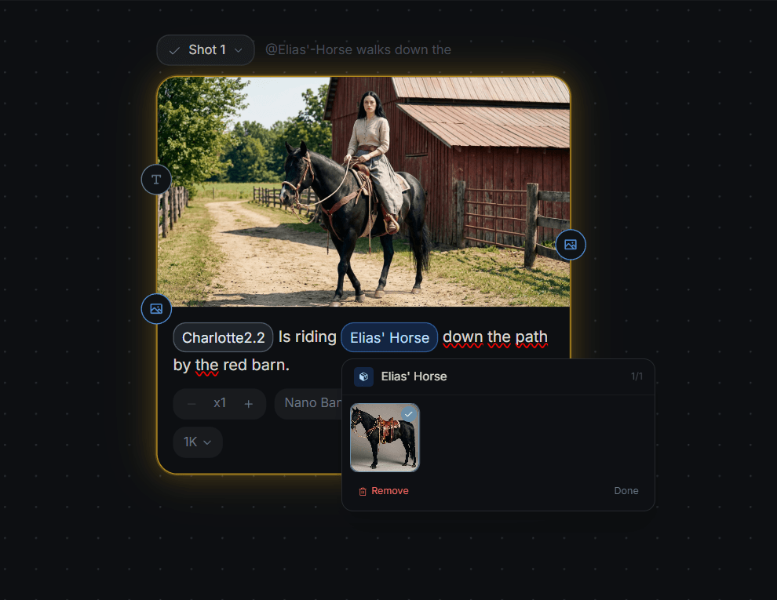

# SPITE

**Built out of spite. Made for control.**

An open-source studio for AI filmmaking — a node-based visual **Canvas**, plus
**Flow**, a fast, linear prompt-to-result mode (desktop and mobile). Bring your
own API keys. Pay providers directly. Own your workflow.

SPITE was built because every AI filmmaking tool either traps you in a
credit system you can't audit, or assumes you're an ML engineer who enjoys
wiring up diffusion models by hand. This is neither. It's a production
canvas for people who think in shots and scenes — characters, prompts,
references, generated images, generated video, all on one infinite plane,
all owned by you.





More at **[spite.run](https://spite.run)**.

---

## What it does

- **Node canvas.** Drag prompts, references, image generators, and video
  generators onto an infinite plane. Connect them. Hit Generate on any
  node and SPITE orchestrates the right model call.
- **Flow mode.** Prefer something simpler? Flow is a linear, conversational
  generation thread (Krea-style): type a prompt, pick a model, generate. Each
  result remembers its prompt, model, aspect, and the references it used —
  Reuse brings them all back. Same projects and models as Canvas, and it works
  from your phone.
- **Character consistency.** Tag images to a named folder
  (Character / Prop / Location), use `@FolderName` in any prompt, and
  SPITE wires the reference into every generation that mentions it.
- **Multi-model.** Nano Banana Pro, FLUX, Kling, Seedance, Luma Ray2,
  MiniMax Hailuo, Wan — all in one canvas, switchable per node, all
  routed through fal.ai with your own key.
- **Scenes and shots.** First-class production primitives. Tag a node as
  Shot 1 of Scene A; the scene strip at the top of the canvas keeps the
  structure visible.
- **Asset library.** Every generation persists, organised by date, model,
  and project. Protected from cleanup if used on a canvas.
- **Generation recovery.** When fal.ai stalls or the page reloads
  mid-generation, the recovery system pulls completed jobs back from fal
  within their 24h retention window. No other tool does this.
- **Cost-aware UX.** Estimated cost on every Generate button. Live fal.ai
  balance badge. `$25` confirmation threshold. Staggered batch submission.
  All built after a real $200-in-24-hours incident.
- **Export.** Storyboard zip with one folder per scene, files named by shot
  order. Drop it straight into Premiere or Resolve.
- **Snapshots.** Canvas state saves every three seconds. Point-in-time
  snapshots kept separately for recovery.
- **Auth.** Single-user password gate. The internet does not need to see
  your work.

## What it deliberately doesn't do

- No video editing — SPITE is pre-production.
- No real-time multi-user collaboration — single-user by design.
- No automation that makes creative decisions for you.
- No credit system, no markup, no subscription.

---

## Self-host

### Fastest way — deploy to Vercel

[](https://vercel.com/new/clone?repository-url=https%3A%2F%2Fgithub.com%2FValiera00%2FSPITE&env=DATABASE_URL%2CAPP_PASSWORD%2CFAL_KEY%2CR2_ACCOUNT_ID%2CR2_ACCESS_KEY_ID%2CR2_SECRET_ACCESS_KEY%2CR2_BUCKET_NAME&envDescription=SPITE%20needs%20a%20database%2C%20object%20storage%20and%20a%20fal.ai%20key.%20The%20guide%20shows%20where%20to%20copy%20each%20value%20from.&envLink=https%3A%2F%2Fgithub.com%2FValiera00%2FSPITE%23configure&project-name=spite&repository-name=spite)

Vercel clones this repo into your own GitHub account and asks for every value in
a form before the first build. No terminal, no editing files. Have these three
tabs open to copy from: [Neon](https://neon.tech) (database),
[Cloudflare R2](https://dash.cloudflare.com) (storage) and
[fal.ai](https://fal.ai) (generation) — the [Configure](#configure) table below
says exactly where each value lives.

**Two things to do after it deploys:**

1. Run [`database-setup.sql`](./database-setup.sql) in your database's SQL console.
2. Set the [R2 CORS policy](#r2-bucket-cors-do-this-once-or-uploads-fail) — uploads fail silently without it.

If anything is missing, SPITE won't boot into a broken app: it routes you to a
`/setup` page listing exactly which values are absent and where to get them.

Prefer doing it by hand, or hosting somewhere other than Vercel? The full manual
walkthrough follows.

### Prerequisites

- Node 20+ and [pnpm](https://pnpm.io/) (or npm/yarn — pnpm is what we
  develop against)
- **Any PostgreSQL database.** `DATABASE_URL` is a standard
  `postgresql://` connection string and [`database-setup.sql`](./database-setup.sql)
  is plain SQL, so Supabase, RDS, Docker or a local Postgres all work.
  [Neon](https://neon.tech)'s free tier is simply what we develop against.
- **S3-compatible object storage.** [Cloudflare R2](https://dash.cloudflare.com)
  by default (free tier covers most personal use). MinIO, Backblaze B2 and AWS S3
  work too — see [Other storage providers](#other-storage-providers).
- A [fal.ai](https://fal.ai) account with a funded key (the generation
  provider — you pay them directly per generation)

### Install

```bash
git clone <your-fork-url>
cd spite
pnpm install
```

### Configure

Copy the template and fill in real values:

```bash
cp .env.example .env.local
```

Every field is required except the ones marked optional. SPITE refuses to
boot with missing variables — it will route every request to a `/setup`
page listing what's missing, with hints. You won't be guessing.

Where to find each value:

| Variable | Source |
|---|---|
| `DATABASE_URL` | neon.tech → your project → Connection string |
| `R2_ACCOUNT_ID` | Cloudflare dashboard → R2 (right sidebar) |
| `R2_ACCESS_KEY_ID`, `R2_SECRET_ACCESS_KEY` | Cloudflare R2 → Manage API tokens → Create API token |
| `R2_BUCKET_NAME` | Whatever you named the bucket you created |
| `FAL_KEY` | fal.ai → Dashboard → Keys |
| `APP_PASSWORD` | You pick — strong, your responsibility |

### Database

Open your database's SQL console — Neon's SQL editor, `psql`, TablePlus,
whatever you use — and paste the contents of
[`database-setup.sql`](./database-setup.sql). Hit Run. The script is
idempotent — re-running it is safe and won't touch existing data.

### R2 bucket CORS (do this once, or uploads fail)

The browser uploads media files directly to R2 via a presigned URL. R2
ships CORS-locked — without a CORS rule the browser's PUT dies with
`Failed to fetch`, and assets never reach the bucket. Set this once
in the Cloudflare dashboard:

1. Cloudflare → **R2** → click your bucket
2. **Settings** tab → **CORS Policy** → **Edit CORS policy**
3. Paste this and save — **replace the placeholder with YOUR deployment's
   exact origin(s)**:

```json
[
  {
    "AllowedOrigins": ["https://your-app.vercel.app", "http://localhost:3000"],
    "AllowedMethods": ["PUT", "GET", "HEAD"],
    "AllowedHeaders": ["*"],
    "ExposeHeaders": ["ETag"],
    "MaxAgeSeconds": 3600
  }
]
```

Pin `AllowedOrigins` to the precise origins you actually deploy from (your
production domain and `http://localhost:3000` for local dev). **Do not use a
broad wildcard like `https://*.vercel.app`** — that would let a page on *any*
Vercel-hosted site drive a browser request against your bucket if it ever
gets hold of a presigned URL. If you use a custom domain, list that instead,
e.g. `"https://your-app.example.com"`. If you genuinely need preview deploys
to upload, add each specific preview origin rather than the whole `*.vercel.app`
space.

### Run

```bash
pnpm dev
```

Open `http://localhost:3000`, type the `APP_PASSWORD` you set, and you're
in.

---

### Other storage providers

**Most people should skip this section.** Cloudflare R2 is the default, it's the
path the setup page walks you through, and it's the one that gets tested. If you
followed the steps above, you're already done.

This is for people who'd rather keep their files somewhere else — MinIO,
Backblaze B2, AWS S3. It assumes you're comfortable creating S3 credentials and
writing a CORS policy yourself, because the setup page won't hold your hand
through this part. If that sentence sounds like work, stay on R2: it's free for
this kind of use and everything is written for it.

To point SPITE at another S3-compatible store, set one extra variable:

| Variable | Effect |
|---|---|
| `S3_ENDPOINT` | Any S3-compatible endpoint, e.g. `https://s3.us-west-002.backblazeb2.com`. Replaces the Cloudflare URL, and `R2_ACCOUNT_ID` is then ignored and no longer required. |
| `S3_REGION` | Only for providers that need a real region (AWS S3). Defaults to `auto`, which is what R2 expects. |

`R2_ACCESS_KEY_ID`, `R2_SECRET_ACCESS_KEY` and `R2_BUCKET_NAME` keep their names
and still apply — they are ordinary S3 credentials.

Leave `S3_ENDPOINT` unset and nothing changes: SPITE talks to R2 exactly as it
always has.

Being straight about how well-trodden this is: the wiring is verified — set a
custom endpoint and SPITE stops asking for `R2_ACCOUNT_ID` and points the S3
client where you tell it. But it has **not** been run end-to-end against every
provider, and each one has its own quirks (AWS needs a real `S3_REGION`, most
need their own CORS syntax). Expect a little debugging, and please open an issue
if you hit something — that's how this path gets better.

## Deploy

SPITE is a standard [Next.js](https://nextjs.org) app: anywhere Node 20+ runs
will host it — a VPS, a container, your own box. Vercel is just the path with
the least setup, and the one below is written out because it's what most people
pick.

### Vercel

1. Push your fork to GitHub.
2. Import the repo on [vercel.com/new](https://vercel.com/new).
3. Vercel → Project → Settings → Environment Variables. Add every name
   from `.env.example` with its real value. (Don't commit `.env.local`
   to git — `.gitignore` should already block it. The included
   [`scripts/check-no-secrets.sh`](./scripts/check-no-secrets.sh) will
   catch you if you try.)
4. Trigger a deploy. The first deploy will route to `/setup` if anything
   is missing.

### Cron cleanup

There's a scheduled cleanup endpoint at `/api/assets/cleanup` that enforces your
data-retention settings (below) and sweeps the auth / spend bookkeeping tables so
they don't grow unbounded. A daily schedule is already defined in
[`vercel.json`](./vercel.json) (04:00 UTC). To activate it, just set `CRON_SECRET`
to a long random string in your Vercel env — Vercel automatically sends it as
`Authorization: Bearer <CRON_SECRET>` on each cron run, and the endpoint refuses
to do anything without a matching secret.

If `CRON_SECRET` is unset the cron simply no-ops (returns 500 and logs), so
nothing breaks — but the cleanup won't run. On non-Vercel hosts, point any
external scheduler (GitHub Actions, etc.) at the same path with that
`Authorization` header; both `GET` and `POST` work.

### Data retention (opt-in — nothing is deleted by default)

Out of the box **SPITE never auto-deletes anything you generate.** Retention is
opt-in per category. Edit it live (no redeploy) under **Settings → Data
Retention**, or set the defaults with two env vars (both default to `0` = keep
forever). A value saved in Settings overrides the env default:

| Variable | Effect | Default |
|---|---|---|
| `ASSET_RETENTION_DAYS` | Delete generated results that were **never added to a canvas** after N days. Anything on a canvas is always kept. | `0` (never) |
| `REFERENCE_RETENTION_DAYS` | Reclaim reference **input** images (attached to a prompt) after N days. The results they produced are never affected. | `0` (never) |

Set a positive number to opt in (e.g. `ASSET_RETENTION_DAYS=30`,
`REFERENCE_RETENTION_DAYS=7`); the daily cron then prunes anything past that age.

---

## Updating

SPITE tells you when a new release is out — a small **"Update vX.Y.Z"** link
appears next to the version number in the top right (plus a one-time toast).

**One-click update (recommended).** Set two env vars on your host and the
Update button does everything — it merges the latest release into your fork on
GitHub, and your host redeploys automatically:

| Variable | Value |
|---|---|
| `GITHUB_UPDATE_REPO` | Your fork, e.g. `alice/SPITE` |
| `GITHUB_UPDATE_TOKEN` | A [fine-grained personal access token](https://github.com/settings/personal-access-tokens/new) scoped to **only that fork**, with **Contents: Read and write** |
| `GITHUB_UPDATE_BRANCH` | Optional — defaults to `main` |

The token stays server-side and is only ever used to call GitHub's
merge-upstream API on your own fork.

**Manual update.** On your fork's GitHub page, click **Sync fork → Update
branch**. Your host redeploys from the push. (Or locally:
`git pull upstream main && git push`.)

**What you don't have to do:** migrate the database. Schema changes are
idempotent and apply themselves on first request after a deploy. Re-running
[`database-setup.sql`](./database-setup.sql) is always safe but never required
for updates.

If your fork has local code changes that conflict with upstream, GitHub will
ask you to resolve the merge — the in-app updater reports this instead of
guessing. New optional env vars are listed in each
[release's notes](https://github.com/Valiera00/SPITE/releases).

---

## Project structure

```
app/                  Next.js App Router pages + API routes
  api/                Server-side endpoints (auth, generate, assets, R2 proxy)
  login/              The password gate
  setup/              Shown when required env vars are missing
  project/[id]/       The Canvas (node graph) for one project
  m/                  Flow mode — the linear generation thread (also mobile)
components/
  canvas/             The node-based workspace (nodes, edges, toolbars)
  ui/                 shadcn/ui primitives
lib/
  env-check.ts        Refuse-to-boot env validation
  r2-upload.ts        R2 SDK wrapper + HMAC URL signing for the proxy
  fal-models.ts       Per-model config: endpoint, input shape, cost
  fal-cost.ts         Cost estimation + confirmation threshold
  mention-prompt.ts   Model-aware reference grammar compilation
scripts/              Tooling (secret check, etc.)
database-setup.sql    Idempotent schema for first-time setup
middleware.ts         Auth gate + env-check redirect
```

## Contributing

Contributions are welcome — especially from people using AI tools in
real production workflows. See [`CONTRIBUTING.md`](./CONTRIBUTING.md) for
how, what's useful, and what isn't.

If something is broken, file an issue with reproduction steps. If you
added a feature, explain what production problem it solves, not just what
it does.

The bar isn't perfection. It's honesty and usefulness.

## Disclaimer

SPITE is provided **as-is, with no warranty of any kind** (see
[`LICENSE`](./LICENSE) for the legal version — AGPL §15 and §16).
You're responsible for:

- **Your fal.ai bill.** The cost gates (per-button estimates, $25
  confirm dialog, live balance badge, server-side per-hour ceiling,
  kill switch) are best-effort. A bug, a misconfiguration, or a
  bypass we haven't anticipated could still result in unexpected
  charges. The hourly ceiling defaults to $100 and can be tuned via
  `SPEND_LIMIT_USD_PER_HOUR`.
- **The content you generate.** SPITE doesn't filter prompts or
  outputs. Whatever your chosen models do, you've made.
- **Your data.** Your assets live in your R2 bucket; your projects
  and metadata live in your Neon database. Nobody else has access.
  If SPITE breaks, the worst case is you redeploy and possibly drop
  a couple of tables. There's no central service that can lose your
  work — it's already in your storage.

If you find a security issue, report it via [GitHub Security
Advisories](https://github.com/Valiera00/SPITE/security/advisories/new),
not a public issue. See [`CONTRIBUTING.md`](./CONTRIBUTING.md) for
the rest of the disclosure flow.

## License

[AGPL-3.0-only](./LICENSE). If you fork SPITE and run it as a service,
your modified source must be available to your users. Self-hosting for
yourself or your team has no such obligation.

This license exists because the whole point of SPITE is that creative
infrastructure shouldn't disappear behind closed doors. Forking SPITE
and making it closed-source would defeat the project's reason for
existing.

---

> SPITE is not finished. That is the point. But it should always be
> getting more useful, not more complicated.
